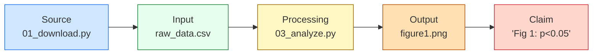

<!-- ---
!-- Timestamp: 2026-03-11 12:29:46
!-- Author: ywatanabe
!-- File: /home/ywatanabe/proj/scitex-clew/README.md
!-- --- -->

# SciTeX Clew (<code>scitex-clew</code>)

<p align="center">
  <a href="https://scitex.ai">
    
  </a>
</p>

<p align="center">
  <a href="https://scitex-clew.readthedocs.io/">Full Documentation</a> · <code>uv pip install scitex-clew[all]</code>
</p>

<!-- scitex-badges:start -->
<p align="center">
  <a href="https://pypi.org/project/scitex-clew/"></a>
  <a href="https://pypi.org/project/scitex-clew/"></a>
  <a href="https://github.com/ywatanabe1989/scitex-clew/actions/workflows/rtd-sphinx-build-on-ubuntu-latest.yml"></a>
</p>
<p align="center">
  <a href="https://github.com/ywatanabe1989/scitex-clew/actions/workflows/pytest-matrix-on-ubuntu-py3-11-3-12-3-13.yml"></a>
  <a href="https://codecov.io/gh/ywatanabe1989/scitex-clew"></a>
</p>
<!-- scitex-badges:end -->

---

## Problem

Scientific publications are growing exponentially — accelerated by LLM-assisted writing — yet peer review remains a manual bottleneck. 70% of researchers report failed replication attempts, and only 11-36% of high-profile findings are successfully reproduced. Existing tools (pre-registration, containerization, workflow managers) address whether research *could be* reproduced, but not whether it *has been*.

## Solution

SciTeX Clew records every artifact produced during research — code, data, figures, statistics — into a **hash-linked DAG (directed acyclic graph)**. This creates a **verifiable knowledge graph** of scientific experiments, which can be explored by humans or AI agents.

Named after the thread Ariadne gave Theseus to trace his path through the labyrinth, Clew serves two purposes:

1. **Reproducibility verification** — confirm that outputs remain unchanged and that every step in the pipeline is intact.
2. **Research logic comprehension** — visualize and navigate the structural skeleton of a research project, from raw data through analysis to manuscript claims.

The DAG is a structured, machine-readable representation of an entire research project — enabling both human reviewers and AI agents to inspect, verify, and understand the logic programmatically. It lets you:

- **Verify** that outputs remain consistent with recorded hashes
- **Trace** provenance chains from any file back to its source
- **Visualize** the structural logic of a research project as a navigable graph
- **Re-execute** scripts in a sandbox to confirm reproducibility
- **Link** manuscript claims to the computational sessions that produced them

### Five Node Classes

Every node in the DAG is classified into one of five semantic roles:

| Class | Role | Examples |
|-------|------|----------|
| **Source** | Data acquisition scripts | `01_download.py`, `collect.sh` |
| **Input** | Raw data and configuration | `raw_data.csv`, `config.yaml` |
| **Processing** | Transform and analysis scripts | `03_analyze.py`, `train.R` |
| **Output** | Intermediate and final data products | `results.csv`, `figure1.png` |
| **Claim** | Manuscript assertions tied to evidence | `"Fig 1 shows p<0.05"`, `"Table 2"` |

<p align="center"><sub><b>Table 1.</b> Five node classes. Classification is inferred automatically from file extensions and session roles, or set explicitly via <code>set_node_class()</code>.</sub></p>

This classification turns the DAG into a navigable map of the research project. The key operation is **backpropagation from claims to sources**: starting from a manuscript assertion (claim), Clew traces backward through outputs, processing scripts, and inputs to the original raw data — verifying every hash along the way.

### Three Verification Modes

| Mode | Scope | API | Description |
|------|-------|-----|-------------|
| **Project** | Entire pipeline | `clew.dag()` | Verifies every session recorded in the database in topological order. A navigation map for ongoing project monitoring. Answers: *"Is the whole project intact?"* |
| **Files** | Specific outputs | `clew.dag(["output.csv"])` | Traces backward from target files through their dependency chain and verifies each session. Answers: *"Can I trust this specific file?"* |
| **Claims** | Manuscript assertions | `clew.verify_claim("Fig 1")` | Verifies individual claims linked to source sessions. Answers: *"Is this figure/statistic still backed by the data?"* |

<p align="center"><sub><b>Table 2.</b> Three verification modes. Each mode supports both <b>cache verification</b> (millisecond hash comparison) and <b>re-run verification</b> (sandbox re-execution with <code>rerun_dag</code> / <code>rerun_claims</code>).</sub></p>

### Grouping for Readable DAGs

Large pipelines emit many per-patient / per-fold files. The grouping API collapses related files into a single DAG node while preserving every underlying hash via a **Merkle root** — aggregate verification remains cryptographically meaningful.

```python
from scitex_clew.groupers import pattern_grouper, auto, compose
import scitex_clew as clew

clew.mermaid(claims=True, grouper=compose(
    pattern_grouper(r"P\d{2}"),   # collapse P01, P02, ..., P15
    auto(),                        # sensible directory + bundle fallbacks
))
```

Project default via `<project_root>/.scitex/clew/config.yaml` (auto-loaded):

```yaml
grouper:
  type: compose
  steps:
    - {type: pattern, regex: 'P\d{2}'}
    - {type: directory, min_size: 10}
    - {type: auto}
```

The same JSON/dict schema works across Python, CLI (`--grouper`), MCP (`{"grouper": {...}}`), and the YAML config file. See the [grouping skill](src/scitex_clew/_skills/scitex-clew/grouping.md).

## Installation

Requires Python >= 3.10. **Zero dependencies** — pure stdlib + sqlite3.

```bash
pip install scitex-clew
```

## Architecture



```
scitex-clew/
├── src/scitex_clew/
│   ├── __init__.py              # status, run, chain, dag, rerun, mermaid
│   ├── _db/                     # sqlite3 hash-linked DAG store (package)
│   │   ├── __init__.py
│   │   ├── _core.py             # VerificationDB, connection mgmt
│   │   ├── _chain.py            # ChainMixin: get_chain, get_children, set_parent
│   │   ├── _queries.py          # VerificationQueryMixin
│   │   └── _parents.py          # Parent-session operations
│   ├── _hash.py                 # file + directory Merkle hashing
│   ├── _chain.py                # VerificationLevel, ChainEntry
│   ├── _claim.py                # Claim CRUD + verification (single file)
│   ├── _dag.py                  # DAG verification
│   ├── _node_class.py           # DAG node classification
│   ├── _stamp.py                # Temporal stamping backends (single file)
│   ├── _rerun.py                # Sandbox re-execution
│   ├── _tracker.py              # Session tracking
│   ├── _registry.py             # Clew Registry client (scitex.ai)
│   ├── _register_intermediate.py# Agentic intermediate-value registration
│   ├── _visualize.py            # Visualization helpers
│   ├── _viz/                    # Graphviz-based DAG rendering
│   ├── _examples.py             # Bundled example locator
│   ├── _logging.py              # Optional scitex.logging integration
│   ├── _linter_plugin.py        # scitex-linter plugin entry point
│   ├── groupers/                # Pattern / directory / auto / compose
│   │   ├── __init__.py
│   │   └── _config.py           # Per-project grouper config loader
│   ├── groupers.py              # Public re-exports
│   ├── _cli/                    # clew entrypoint (recursive --help)
│   ├── _mcp/                    # MCP server for AI agents
│   │   ├── server.py            # FastMCP server
│   │   └── tools/               # Tool definitions (skills, claims, hashing, stamping, verification)
│   └── _skills/scitex-clew/     # Workflow skill pages
└── tests/
```

## Quickstart

```python
import scitex_clew as clew

# Git-status-like overview
clew.status()

# Verify a run (hash check)
result = clew.run("session_20250301_143022")

# Trace a file's provenance chain
chain = clew.chain("output/figure.png")

# Verify the full DAG
dag_result = clew.dag(["output/figure.png"])

# Re-execute in sandbox and compare
rerun_result = clew.rerun("session_20250301_143022")
```

<p align="center">
  
</p>
<p align="center"><sub><b>Figure 1.</b> Example DAG visualization. Green nodes indicate verified sessions; red nodes indicate hash mismatches. Clew traces the dependency graph backward from target files to raw data sources.</sub></p>

## Four Interfaces

<details open>
<summary><strong>Python API</strong></summary>

<br>

```python
import scitex_clew as clew

clew.status()                              # overview
clew.run("session_id")                     # verify one run
clew.chain("output/figure.png")            # trace provenance
clew.dag(["output/figure.png"])            # verify full DAG
clew.rerun("session_id")                   # sandbox re-execution
clew.mermaid(claims=True)                  # Mermaid DAG diagram
clew.add_claim("Fig 1 shows p<0.05", source_files=["fig1.png"])
```

> **[Full API reference](https://scitex-clew.readthedocs.io/en/latest/api/scitex_clew.html)**

</details>

<details>
<summary><strong>CLI Commands</strong></summary>

<br>

```bash
clew --help-recursive                      # Show all commands
clew status                                # Git-status-like overview
clew verify <session_id>                   # Verify a run
clew list                                  # List tracked runs
clew stats                                 # Database statistics
clew mermaid                               # Generate Mermaid diagram
clew list-python-apis                      # List Python API tree
clew mcp list-tools                        # List MCP tools

# Claims, hashing, stamping (F1)
clew claim add --file-path paper.tex --type statistic --value "p=0.003"
clew claim list
clew claim verify <claim_id>
clew hash-file path/to/data.csv
clew hash-directory path/to/dir/
clew stamp --backend file
clew list-stamps
clew check-stamp [STAMP_ID]

# Universal --json on every command (F5)
clew --json status
clew status --json
clew --json list --limit 20

# Strict DAG verification with failure attribution (F2)
clew dag --strict --json --target results/figure.csv
```

> **[Full CLI reference](https://scitex-clew.readthedocs.io/en/latest/quickstart.html)**

</details>

<details>
<summary><strong>MCP Server — for AI Agents</strong></summary>

<br>

AI agents can verify reproducibility and trace provenance autonomously.

| Tool | Description |
|------|-------------|
| `clew_status` | Git-status-like overview |
| `clew_run` | Verify a specific run |
| `clew_chain` | Trace file provenance chain |
| `clew_dag` | Verify full DAG (`strict=True` returns failure attribution, F2) |
| `clew_list_runs` | List tracked runs |
| `clew_stats` | Database statistics |
| `clew_mermaid` | Generate Mermaid DAG diagram |
| `clew_rerun_dag` | Rerun full DAG in sandbox |
| `clew_rerun_claims` | Rerun all claim-backing sessions |
| `clew_add_claim` / `clew_list_claims` / `clew_verify_claim` | Claim CRUD (F1) |
| `clew_hash_file` / `clew_hash_directory` | File/directory hashing (F1) |
| `clew_stamp` / `clew_list_stamps` / `clew_check_stamp` | Temporal stamping (F1) |

<sub><b>Table 3.</b> MCP tools available for AI-assisted verification. All tools accept JSON parameters and return JSON results.</sub>

```bash
clew mcp start
```

> **[Full MCP specification](https://scitex-clew.readthedocs.io/en/latest/api/scitex_clew._mcp.html)**

</details>

<details>
<summary><strong>Skills</strong></summary>

<br>

Skills provide workflow-oriented guides that AI agents query to discover capabilities and usage patterns.

```bash
clew skills list              # List available skill pages
clew skills get SKILL         # Show main skill page
scitex-dev skills export --package scitex-clew  # Export to Claude Code
```

| Skill | Content |
|-------|---------|
| `quick-start` | Basic API, session tracking, first verification |
| `cli-commands` | CLI reference (`clew status`, `clew verify`, etc.) |
| `mcp-tools-for-ai-agents` | MCP tool reference for AI agents |
| `common-workflows` | Claims, DAG patterns, stamps, reproducibility |

</details>

## Demo

<p align="center">
  
</p>
<p align="center"><sub><b>Figure 2.</b> Live DAG verification. Green nodes are sessions whose recorded hashes still match disk; red nodes flag a drift. <code>clew dag --strict</code> walks claims back to raw data and prints the first failure.</sub></p>

## Part of SciTeX

`scitex-clew` is part of [**SciTeX**](https://scitex.ai). Install via
the umbrella with `pip install scitex[clew]` to use as
`scitex.clew` (Python) or `scitex clew ...` (CLI).

```python
import scitex

@scitex.session
def main(CONFIG=scitex.INJECTED):
    data = scitex.io.load("input.csv")    # auto-tracked as input
    result = process(data)
    scitex.io.save(result, "output.csv")   # auto-tracked as output
    return 0
```

All file I/O through `scitex.io` is recorded in the clew database:

```python
scitex.clew.status()              # overview
scitex.clew.run("session_id")     # verify
scitex.clew.mermaid(claims=True)  # DAG diagram
```

The SciTeX system follows the Four Freedoms for Research below, inspired by [the Free Software Definition](https://www.gnu.org/philosophy/free-sw.en.html):

>Four Freedoms for Research
>
>0. The freedom to **run** your research anywhere — your machine, your terms.
>1. The freedom to **study** how every step works — from raw data to final manuscript.
>2. The freedom to **redistribute** your workflows, not just your papers.
>3. The freedom to **modify** any module and share improvements with the community.
>
>AGPL-3.0 — because we believe research infrastructure deserves the same freedoms as the software it runs on.

---

<p align="center">
  <a href="https://scitex.ai" target="_blank"></a>
</p>

<!-- EOF -->
