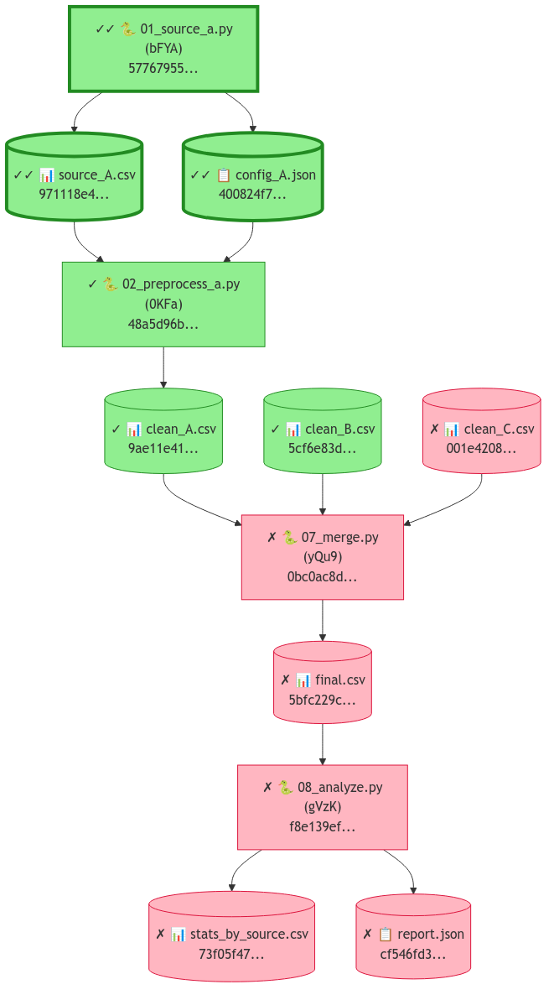

# Clew (<code>scitex-clew</code>)

<p align="center">
  <a href="https://scitex.ai">
    
  </a>
</p>

<p align="center"><b>Hash-based reproducibility verification for scientific pipelines</b></p>

<p align="center">
  <a href="https://badge.fury.io/py/scitex-clew"></a>
  <a href="https://scitex-clew.readthedocs.io/"></a>
  <a href="https://github.com/ywatanabe1989/scitex-clew/actions/workflows/test.yml"></a>
  <a href="https://www.gnu.org/licenses/agpl-3.0"></a>
</p>

<p align="center">
  <a href="https://scitex-clew.readthedocs.io/">Full Documentation</a> · <code>pip install scitex-clew</code>
</p>

---

## Problem

70% of researchers report failed replication attempts, and only 11-36% of high-profile findings are successfully reproduced. Existing tools — pre-registration, containerization, workflow managers — address whether research *could be* reproduced, but not whether it *has been*. Unrecorded manual steps, implementation gaps, and missing provenance mean that even well-intentioned pipelines silently diverge from their published claims.

## Solution

Clew — named after the thread Ariadne gave Theseus to trace his path through the labyrinth — records SHA-256 hashes at every step your pipeline reads and writes, stored in a local SQLite database. It lets you:

- **Verify** that outputs haven't changed since recording
- **Trace** provenance chains from any file back to its source
- **Re-execute** scripts in a sandbox to confirm reproducibility
- **Link** manuscript claims to the sessions that produced them

## Installation

Requires Python >= 3.10. **Zero dependencies** — pure stdlib + sqlite3.

```bash
pip install scitex-clew
```

> **SciTeX users**: `pip install scitex` already includes Clew. Tracking is automatic via `@scitex.session` + `scitex.io`.

## Quickstart

```python
import scitex_clew as clew

# Git-status-like overview
clew.status()

# Verify a run (hash check)
result = clew.run("session_20250301_143022")

# Trace a file's provenance chain
chain = clew.chain("output/figure.png")

# Verify the full DAG
dag_result = clew.dag(["output/figure.png"])

# Re-execute in sandbox and compare
rerun_result = clew.rerun("session_20250301_143022")
```

<p align="center">
  
</p>

## Three Interfaces

<details>
<summary><strong>Python API</strong></summary>

<br>

```python
import scitex_clew as clew

clew.status()                              # overview
clew.run("session_id")                     # verify one run
clew.chain("output/figure.png")            # trace provenance
clew.dag(["output/figure.png"])            # verify full DAG
clew.rerun("session_id")                   # sandbox re-execution
clew.mermaid(claims=True)                  # Mermaid DAG diagram
clew.add_claim("Fig 1 shows p<0.05", source_files=["fig1.png"])
```

> **[Full API reference](https://scitex-clew.readthedocs.io/)**

</details>

<details>
<summary><strong>CLI Commands</strong></summary>

<br>

```bash
clew --help-recursive                      # Show all commands
clew status                                # Git-status-like overview
clew verify <session_id>                   # Verify a run
clew list                                  # List tracked runs
clew stats                                 # Database statistics
clew mermaid                               # Generate Mermaid diagram
clew list-python-apis                      # List Python API tree
clew mcp list-tools                        # List MCP tools
```

> **[Full CLI reference](https://scitex-clew.readthedocs.io/)**

</details>

<details>
<summary><strong>MCP Server — for AI Agents</strong></summary>

<br>

AI agents can verify reproducibility and trace provenance autonomously.

| Tool | Description |
|------|-------------|
| `clew_status` | Git-status-like overview |
| `clew_run` | Verify a specific run |
| `clew_chain` | Trace file provenance chain |
| `clew_dag` | Verify full DAG |
| `clew_list` | List tracked runs |
| `clew_stats` | Database statistics |
| `clew_mermaid` | Generate Mermaid DAG diagram |
| `clew_rerun_dag` | Rerun full DAG in sandbox |
| `clew_rerun_claims` | Rerun all claim-backing sessions |

```bash
clew mcp start
```

> **[Full MCP specification](https://scitex-clew.readthedocs.io/)**

</details>

## Part of SciTeX

Clew is part of [**SciTeX**](https://scitex.ai). When used inside the SciTeX framework, tracking is automatic:

```python
import scitex

@scitex.session
def main(CONFIG=scitex.INJECTED):
    data = scitex.io.load("input.csv")    # auto-tracked as input
    result = process(data)
    scitex.io.save(result, "output.csv")   # auto-tracked as output
    return 0
```

All file I/O through `scitex.io` is recorded in the clew database:

```python
scitex.clew.status()              # overview
scitex.clew.run("session_id")     # verify
scitex.clew.mermaid(claims=True)  # DAG diagram
```

The SciTeX ecosystem follows the Four Freedoms for researchers:

>Four Freedoms for Research
>
>0. The freedom to **run** your research anywhere — your machine, your terms.
>1. The freedom to **study** how every step works — from raw data to final manuscript.
>2. The freedom to **redistribute** your workflows, not just your papers.
>3. The freedom to **modify** any module and share improvements with the community.
>
>AGPL-3.0 — because research infrastructure deserves the same freedoms as the software it runs on.

---

<p align="center">
  <a href="https://scitex.ai" target="_blank"></a>
</p>

<!-- EOF -->
